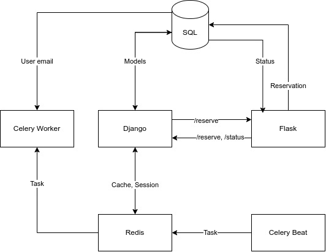

Z uwagi na urlop limit czasu na wykonanie zadania był, nieco mniejszy niż zakładałem, dlatego w kodzie mogą znajdować się pewne obejścia lub rozwiązania tymczasowe. Przy odrobinie czasu na pewno można to było zrobić lepiej. Mimo wszystko główne funkcjonalności są dostępne i można je przetestować. 

## Wymagania
### Django
- modele stworzone
- CRUD działa
- rezerwacje przy użyciu API działają
- można autoryzować się przy użyciu JWT
- zaplanowane cykliczne zadania celery 
- brak odświeżania statusu książek celery
### Flask
- serwis dostępny dla django
- /status/id zwraca dane z bazy
- /reserve zapisuje rezerwację 
- walidacja danych przy użyciu dataclass
- brak logów
### Mysql:
- baza wystartuje razem z innymi aplikacjami oraz utworzy tabele
### Redis
- przechowuje sesje i obsługuje celery
### Integracja z zewnętrznymi API
- może być zaimplementowana analogicznie jak komunikacja z Flask przy użyciu klasy Requester
### Dodatkowe
- przykładowa implementacja zapisywania logów do bazy w Django
- django rest dostarcza formularze do obsługi api, brak automatycznej dokumentacji dla Flask
- brak testów

## Dokumentacja
### Uruchomienie
Aby uruchomić wszystkie serwisy: `docker compose up`. Serwis django dostępny będzie pod adresem IP maszyny i portem `8013`, serwis flask ma port `5013`.
### Autoryzacja
Do używania aplikacji Django można użyć dostarczonego przez Django Rest Framework frontu dostępnego w poniższych endpointach. 
Ścieżki, które wymagają autoryzacji użytkownika, zabezpieczone tokenem można otworzyć, dodając nagłówek `authorization: Bearer <token>`

### Endpointy
- *users/*-listuje użytkowników, dostarcza formularz kreacji użytkownika
- *users/<id>*- podaje użytkownika i umożliwia operacje na obiekcie 
- *register/* - tworzy nowego użytkownika
- *login/* - loguje i zwraca token
- *api/token/refresh/* - odświeża token użytkownika
- *books/* - listuje książki i umożliwia ich tworzenie
- *books/<id>* - podaje książkę i umożliwia modyfikacje
- *reservations/* - listuje rezerwacje
- *reservations/<id>* - dostarcza rezerwację oraz umożliwia modyfikację
- *reserve/* - tworzy nową rezerwację

### Schemat

